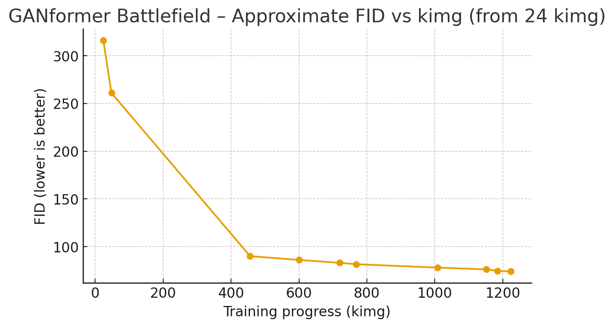
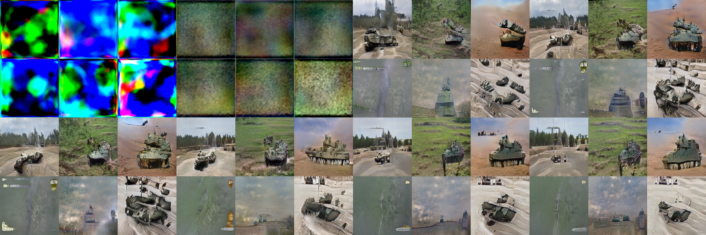

# GANformer Battlefield Model (GAT) — Research & Local Setup Guide

This repository explains how to:

1. Install a Python virtual environment on your own machine.
2. Clone and use the **official GANformer (GAT)** repository by Dor Arad.
3. Download and use our **pretrained battlefield GANformer model**.
4. Train GANformer on **your own dataset** and generate images.
---
## Research motivation

This repo accompanies a small research project exploring **Generative Adversarial Transformers (GANformer)** for complex military imagery.

Instead of classical StyleGAN on faces or bedrooms, we deliberately chose a **hard, composite domain**:

- Battlefield scenes with **multiple objects** (tanks, artillery, landscape, tracks, smoke, etc.)
- Strong variation in **viewpoint, scale and background**
- Significant **noise in the data** (motion blur, compression, camera quality)

The goal was **not** to beat SOTA FID on a clean benchmark, but to:

1. Verify that Dor Arad’s **GANformer architecture** can learn coherent structure on such a dataset.
2. Study how far we can get with **one RTX 4090** and a fixed time budget.
3. Document the **practical engineering pain points** of reproducing this type of model outside a lab environment.


## Methodology & architecture

We use the **official GANformer PyTorch implementation** (`pytorch_version`) with the `--ganformer-default` configuration:

- **Generator**:
  - A set of **latent tokens** (object slots) attends to convolutional feature maps.
  - Duplex attention allows **top-down (latents → image features)** and **bottom-up (image features → latents)** information flow.
  - This supports compositional structure: different latents specialize to different regions / parts of the scene.

- **Discriminator**:
  - Convolutional backbone with **transformer blocks** attending over spatial features.
  - Encourages consistency between local texture and global layout.

- **Training objective**:
  - Non-saturating GAN loss with **R1 regularization**, as in StyleGAN2 / GANformer.
  - FID is periodically evaluated on 5k generated samples (**FID5k**) against real battlefield images.

- **Data pipeline**:
  - Raw images → center crop / resize to **256×256 RGB**.
  - Packed into an internal GANformer dataset using `prepare_data.py`, then streamed with augmentations during training.

Conceptually, this matches the dissertation’s argument that **compositional latent structure + attention** can generalize better on multi-object scenes than a single global style vector.

## Experimental setup

**Hardware**

- GPU: NVIDIA RTX 4090 (24 GB)
- Host: Linux environment (RunPod)
- Approx. speed: ~120–123 sec / kimg at 256×256

**Dataset**

- Source: Military Assets / battlefield imagery (YOLO-style dataset)
- After filtering & preprocessing:
  - **26,315** training images
  - All resized to **256×256**, 3 channels (RGB)
  - Significant diversity in:
    - Camera angle (ground, slightly aerial)
    - Scene type (desert, forest, mud, urban edges)
    - Number and type of vehicles / assets

**Training configuration**

- Script: `run_network.py`
- Key flags:

  ```bash
  python run_network.py \
    --train \
    --gpus 0 \
    --ganformer-default \
    --expname battlefield-scratch \
    --dataset battlefield \
    --data-dir datasets \
    --resolution 256 \
    --total-kimg 8000 \   # target only, we stopped earlier
    --eval-images-num 5000 \
    --metrics fid
  ```


## Training curve (FID vs kimg)



## Results

### Quantitative

The plot below shows the **approximate FID5k** trajectory during training  
(FID measured on 5k generated samples vs. the real battlefield dataset).


- Early training (24–48 kimg) is extremely noisy:
  - FID ≈ **316 → 261**
  - Samples are pure colored noise / blobs.
- Mid training (400–800 kimg):
  - FID drops into the **90–80** range.
  - Coarse structure appears: sky, ground plane, large green/brown masses that roughly look like vehicles or terrain patches.
- Late training (1000–1224 kimg):
  - FID stabilizes around **74–75**.
  - Vehicles become recognizable, with rough silhouettes and plausible shading.
  - Background layouts (road, tracks, dunes, fields) are clearly visible.

Given the difficulty of the dataset and limited kimg budget, this is a **reasonable convergence point**, but not photorealistic.

### Qualitative

Visually, the model captures:

- Coherent **global layout**: horizon line, sky vs. ground, rough perspective.
- Emergence of **vehicle-like blobs** with turrets, tracks, and shadows.
- Scene-level consistency: objects appear in plausible places (on the ground, following tracks, etc.).

However, it struggles with:

- **Fine texture:** armor plating, small details, tracks, dust plumes.
- **Sharp edges:** outlines are often smeared or “melting” into the background.
- **Object identity:** tanks / APCs / artillery often blur into generic “military metal lumps”.

This matches expectations from the dissertation: GANformer can model **composition and layout** relatively early, but achieving **pixel-level realism** requires more data, longer training, and additional tuning.

## Sample generations

The grid below shows 8 samples (4×2) from the shared battlefield checkpoint
`network-snapshot-001224.pkl` at 256×256 resolution.




## Engineering challenges & lessons learned

This project was intentionally run in a **realistic, messy environment**, not a perfectly curated lab setup. A non-exhaustive list of issues we hit:

### 1. Environment & CUDA mismatches

- On Colab and some local setups we encountered errors like:

  - `upfirdn2d_plugin` / `conv2d_gradfix` not found  
  - Custom ops failing to compile due to **Torch/CUDA version drift**

- Resolution: we eventually moved to a **fixed Docker/RunPod image** and stopped trying to support “whatever PyTorch happens to be installed”.
- Takeaway: **GANformer is sensitive** to exact library versions; reproducing results on arbitrary Colab runtimes is painful.

### 2. Storage and volume configuration

- We initially underestimated **volume disk size**:
  - Dataset (26k images), checkpoints, and FID caches quickly filled the default volume.
- We had to:
  - Increase the **persistent volume**, and
  - Be careful about old experiment folders under `results/`.
- Takeaway: for 256×256 experiments with many snapshots, budget **tens of GB** of disk, not a tiny sandbox.

### 3. Remote file transfer friction

- Exporting samples & snapshots from the pod required setting up **`rclone` → Google Drive**.
- Installing `rclone` inside the container and doing the manual OAuth token flow was tedious but ultimately worked.
- Takeaway: plan a **clean logging + export strategy** early (rclone, S3, or SCP), otherwise you lose snapshots or waste time shuttling files.

### 4. Dataset complexity vs. resources

- The battlefield dataset is:
  - Large (26k images),
  - Highly varied,
  - And visually cluttered.
- With a **single 4090 and ~24h of wall-time**, we had to stop at ~1224 kimg.
- The model clearly **had not saturated yet**; more kimg would likely give:
  - Better textures,
  - Sharper edges,
  - Lower FID.

We also considered training **smaller, more coherent subsets** (e.g. “weapons only” or “soldiers only” ~700–1000 images), but did not have GPU time to run those experiments.

### 5. Unrealistic expectations vs. real constraints

- It is very tempting to compare ourselves to the **face samples** from the GANformer repo (which are almost perfectly photorealistic).
- In reality, those results benefit from:
  - Clean, curated datasets (FFHQ),
  - Longer training,
  - Heavy engineering on hyper-parameters and augmentations.

Our battlefield model demonstrates **successful learning of structure and composition**, but not the “you can’t tell it’s fake” level.  
This is important to state honestly for anyone reading this as “research work”.

## Limitations & future work

**Limitations**

- **Under-training:** stopping at ~1224 kimg is significantly below the 8k–25k kimg regimes used in many StyleGAN/GANformer papers for complex datasets.
- **No class conditioning:** we trained a **single unconditional model** on all battlefield images.  
  There is no label or class information (e.g. tank vs. APC vs. artillery), which makes the generative problem harder.
- **Approximate metrics:** the FID curve in this repo is reconstructed from logged values and is meant to show **trends**, not be a strict benchmark.
- **Single resolution:** we only trained at **256×256**; higher resolutions would require more memory and longer runs.

**Future work**

- **Longer training & hyper-parameter sweeps**:
  - Explore training up to 4k–8k kimg on the same dataset.
  - Try alternative regularization strength, learning rates, and augmentations.
- **Class-conditional GANformer**:
  - Use YOLO labels (e.g. weapon, soldier, vehicle) to train a conditional or multi-head model.
- **Smaller, coherent subsets**:
  - Weapons-only model (≈700–1000 images).
  - Soldiers-only model, or a vehicle-only subset.
  - Compare sample quality and FID to the full mixed battlefield dataset.
- **Attention visualization**:
  - Visualize which spatial regions each latent token attends to.
  - Connect this to the dissertation’s discussion of **compositional representation learning** and object-level specialization.


## Environment & setup requirements

## 1. Requirements

You will need:

- Python **3.8–3.10**
- Git
- An NVIDIA GPU with CUDA (for training / fast generation)
- `pip` (Python package manager)

Recommended OS: **Linux**.  
Windows with WSL2 or native Python can also work if you are comfortable with it.

> ⚠️ Note: GANformer uses custom CUDA ops.  
> Make sure your **PyTorch + CUDA** setup is consistent.  
> If the *original* GANformer repo runs (e.g. their bedrooms example), this battlefield model will also run.

---

## 2. Clone the official GANformer repository

Open a terminal and run:

```bash
git clone https://github.com/dorarad/gansformer.git
cd gansformer/pytorch_version
```

You should now see files such as:

- run_network.py
- generate.py
- prepare_data.py
- torch_utils/ etc.

All commands below assume you are in this folder:

```bash
cd gansformer/pytorch_version
```

---

## 3. Create and activate a virtual environment

### 3.1 Linux / macOS

```bash
python3 -m venv .venv
source .venv/bin/activate
```

You should now see `(.venv)` at the start of your shell prompt.

### 3.2 Windows (PowerShell)

```powershell
py -3 -m venv .venv
.\.venv\Scripts\Activate.ps1
```

If PowerShell blocks scripts, you may need to adjust the execution policy or use `cmd.exe` and `.\.venv\Scriptsctivate.bat`.

---

## 4. Install Python dependencies

GANformer was originally developed for older PyTorch & CUDA versions. The exact combination depends on your system.

### Option A — Use your existing working setup

If you already have **PyTorch + CUDA** installed and working, just install the extra libraries:

```bash
pip install numpy pillow scipy h5py opencv-python
```

Then later test by running a `generate.py` command.  
If it runs without errors, you are good.

### Option B — Follow the original GANformer guidance

Read the original GANformer README / issues for the recommended PyTorch + CUDA versions.

As a rough example (this is **not** guaranteed):

```bash
pip install "torch==1.10.0" "torchvision==0.11.1"  # Match this to your CUDA
pip install numpy pillow scipy h5py opencv-python
```

If you see errors about `upfirdn2d_plugin`, `conv2d_gradfix`, or `custom_ops`, it usually means there is a mismatch between:

- your PyTorch / CUDA version  
and
- the compiled custom CUDA ops.

Fixing that is system-specific and beyond this README; the important point is:  
👉 if the official `gansformer` repo runs for you, the battlefield model here will also run.

---

## 5. Download the pretrained **battlefield** model

We provide a snapshot trained on a **battlefield scene dataset** at 256×256 resolution, stopped at **1224 kimg**.

Download it via GitHub Releases:

```bash
# From inside gansformer/pytorch_version
wget https://github.com/mag-and-krotons/GAT/releases/download/v1.0.0/network-snapshot-001224.pkl -O battlefield_snapshot_001224.pkl
```

After downloading, you should have:

gansformer/pytorch_version/battlefield_snapshot_001224.pkl

---

## 6. Generate images from the battlefield model

With your virtual environment activated and the model downloaded:

```bash
cd gansformer/pytorch_version
source .venv/bin/activate      # or .\.venv\Scriptsctivate on Windows

python generate.py   --gpus 0   --model battlefield_snapshot_001224.pkl   --images-num 36   --output-dir battlefield_samples   --truncation-psi 0.7
```

Explanation of arguments:

- `--gpus 0` — use GPU 0.
- `--model` — path to the checkpoint .pkl file.
- `--images-num` — how many images to generate.
- `--output-dir` — where the PNG files will be saved.
- `--truncation-psi` — controls diversity vs. quality:
  - lower (e.g. 0.5–0.7): fewer weird images, less diversity;
  - higher (e.g. 0.8–1.0): more diverse, but also more artifacts.

Once it finishes, inspect the output directory:

```bash
ls battlefield_samples
```

You should see files like 000000.png, 000001.png, etc.

---

## 7. (Optional) Continue training the battlefield model

If you want to **continue training** our battlefield model on your own machine:

1. You must have prepared a matching dataset as `datasets/battlefield/`.
2. Then you can start a new experiment initialized from the pretrained snapshot:

```bash
cd gansformer/pytorch_version
source .venv/bin/activate

python run_network.py   --train   --gpus 0   --ganformer-default   --expname battlefield-finetune   --dataset battlefield   --data-dir datasets   --resolution 256   --pretrained-pkl battlefield_snapshot_001224.pkl   --eval-images-num 5000   --metrics fid
```

- `--pretrained-pkl battlefield_snapshot_001224.pkl` loads our weights.
- `--expname battlefield-finetune` writes logs and snapshots to:

  results/battlefield-finetune-000/

You can stop training whenever you like; checkpoints are saved periodically.

---

## 8. Train GANformer on **your own dataset**

You can also use the original GANformer code to train on **any** image dataset.

### 8.1 Prepare your images

Organize your images like this:

gansformer/pytorch_version/data_raw/mydataset_raw/
    img0001.jpg
    img0002.jpg
    ...

Optionally resize them to 256×256:

```bash
cd gansformer/pytorch_version
source .venv/bin/activate

python - << 'EOF'
from pathlib import Path
from PIL import Image

src = Path("data_raw/mydataset_raw")
dst = Path("data_raw/mydataset_256")
dst.mkdir(parents=True, exist_ok=True)

count = 0
for p in src.glob("*"):
    if p.suffix.lower() not in [".jpg", ".jpeg", ".png"]:
        continue
    img = Image.open(p).convert("RGB")
    img = img.resize((256, 256), Image.LANCZOS)
    img.save(dst / (p.stem + ".jpg"), quality=95)
    count += 1

print(f"Resized {count} images into {dst}")
EOF
```

Now you have a clean 256×256 version of your dataset at:

data_raw/mydataset_256/

### 8.2 Build a GANformer dataset

Convert this into the internal GANformer format:

```bash
python prepare_data.py   --task mydataset   --images-dir data_raw/mydataset_256   --format jpg   --ratio 1.0   --data-dir datasets
```

This will create:

datasets/mydataset/

Here, `mydataset` is the **dataset name** you’ll use with `--dataset`.

### 8.3 Train from scratch on your dataset

Start training:

```bash
python run_network.py   --train   --gpus 0   --ganformer-default   --expname mydataset-scratch   --dataset mydataset   --data-dir datasets   --resolution 256   --total-kimg 1000   --eval-images-num 5000   --metrics fid
```

- `--expname mydataset-scratch` → results go into:

  results/mydataset-scratch-000/

- `--total-kimg` controls how long to train:
  - 200–500 kimg: quick experiment.
  - 1000–2000+ kimg: more serious run (longer time).

Inside results/mydataset-scratch-000/ you’ll find:

- network-snapshot-000XYZ.pkl — generator checkpoints.
- fakes000XYZ.png — sample grids.
- metric-fid*.txt — if FID was enabled.

---

## 9. Generate images from your own trained model

Once you have a snapshot you like (e.g. `network-snapshot-000300.pkl`):

```bash
cd gansformer/pytorch_version
source .venv/bin/activate

python generate.py   --gpus 0   --model results/mydataset-scratch-000/network-snapshot-000300.pkl   --images-num 36   --output-dir samples_mydataset_000300   --truncation-psi 0.7
```

Check the output:

```bash
ls samples_mydataset_000300
```

You should see your generated images there.

---

## 10. Summary

- **Code**: we strictly use the original GANformer implementation from  
  https://github.com/dorarad/gansformer
- **This repo**: provides a *battlefield-trained* checkpoint (`network-snapshot-001224.pkl`) and a clear way to:
  - set up a local virtual environment,
  - download the checkpoint,
  - generate images,
  - and train GANformer on your own dataset.

If you can successfully run the official GANformer repo on your machine,  
you can plug in this battlefield model and your own images using the commands above.

## Acknowledgements

This project is built on top of the original **GANformer** implementation by **Dor Arad** and collaborators.

- Official repository: https://github.com/dorarad/gansformer  
- Original paper / dissertation: *Generative Adversarial Transformers (GANformer)* by Dor Arad et al.

All core model code, architecture definitions, and training scripts are from the official GANformer repo; this project only adds:
- a pretrained battlefield checkpoint,
- dataset preparation details,
- training logs, plots, and analysis,
- and a reproducible workflow for running GANformer on this specific dataset.


## Contact & feedback

This repository is part of an ongoing study of Generative Adversarial Transformers on complex military imagery.

For clarification of any details, discussion of results, or proposals for further experiments, please contact:

**Abhijit Singh**  
📧 `abhijitsingh777@gmail.com`
